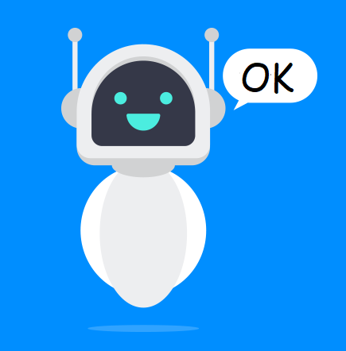

ПРОЕКТ ChatBot "ОК"

1. Участници
*	Иван Назаренко - Scrum Trainer 9Б (IYNazarenko19@codingburgas.bg)
*	Златомир Костадинов - Developer BackEnd 9В (ZGKostadinov19@codingburgas.bg)
*	Николай Димитров - Developer FrontEnd 9Б (NDDimitrov19@codingburgas.bg)
*	Георги Милев - Code Checker 9Г (GNMilev19@codingburgas.bg)
*	Егор Семенов - Quality Engineer 9A (EDSemenov19@codingburgas.bg)

2. Идея
*	Идеята ни е да създадем умен и забавен ЧатБот “ОК”.

3. Бъдеще на проекта
*	Искаме да добавим ЧатБот “ОК” в интернет пространството.
*	Ще създадем собствен сайт за ползването на ЧатБота “ОК”.

